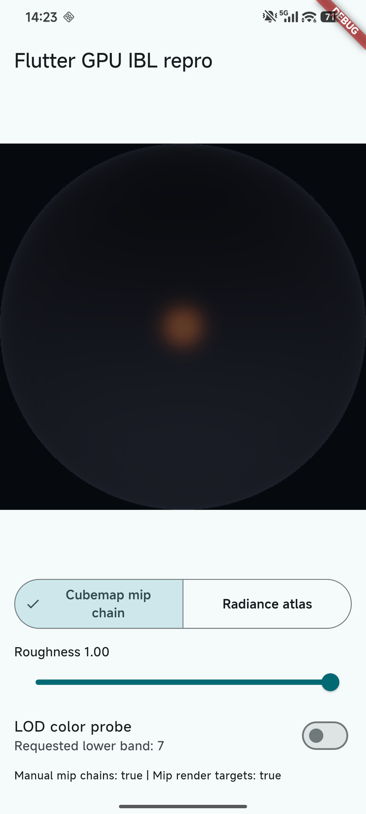
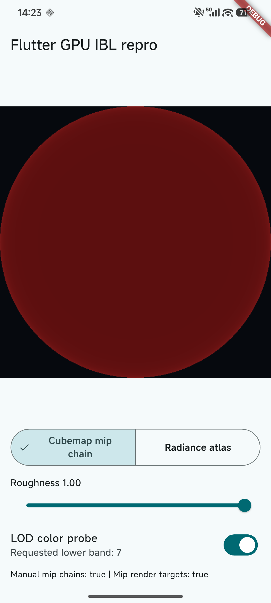
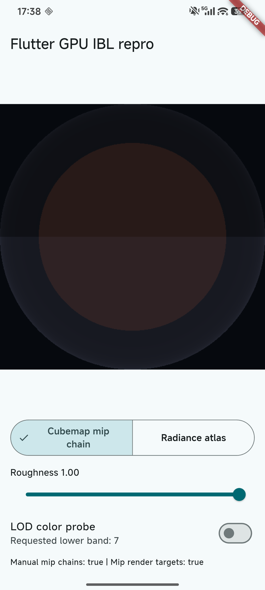
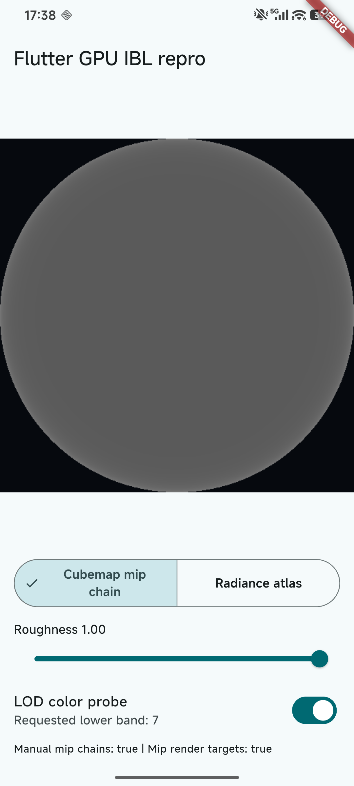
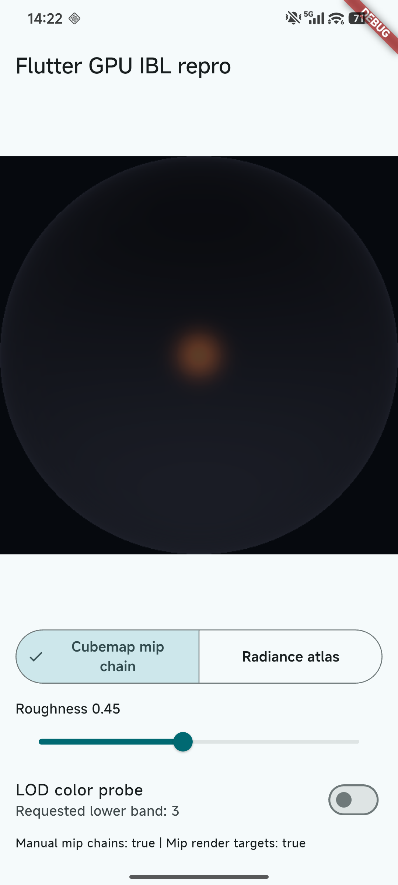
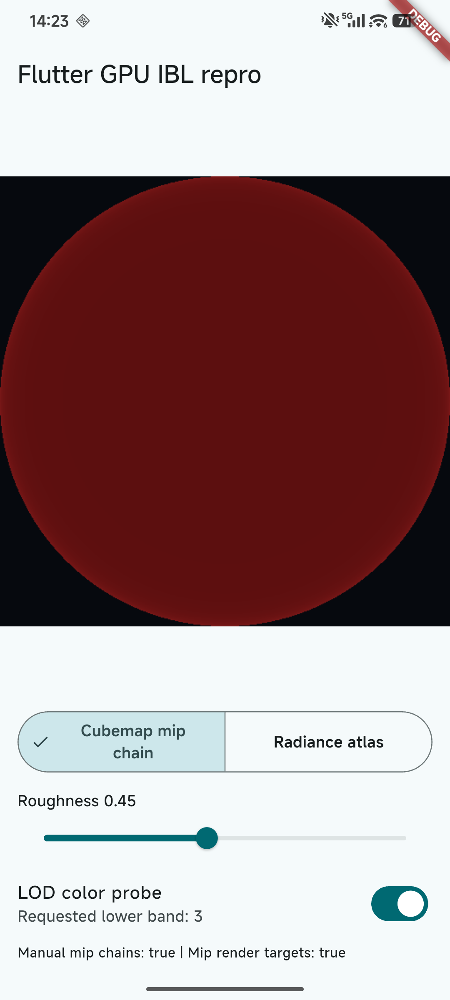
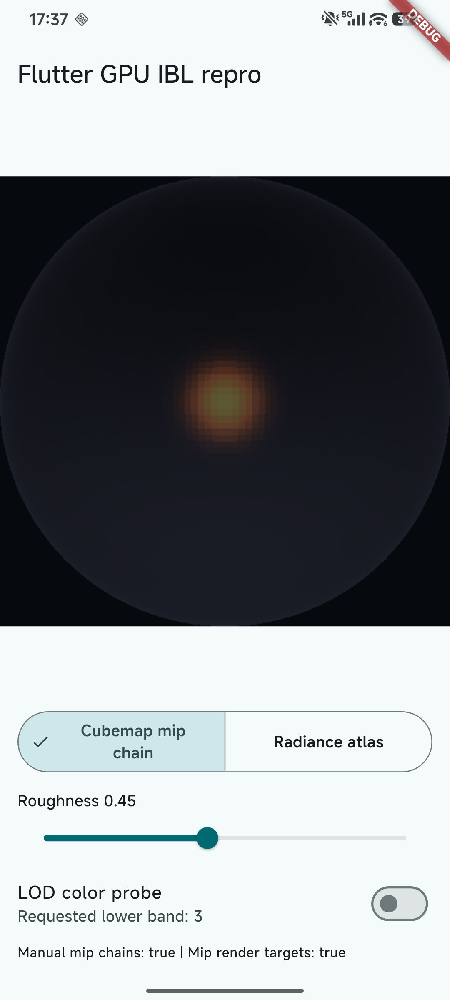
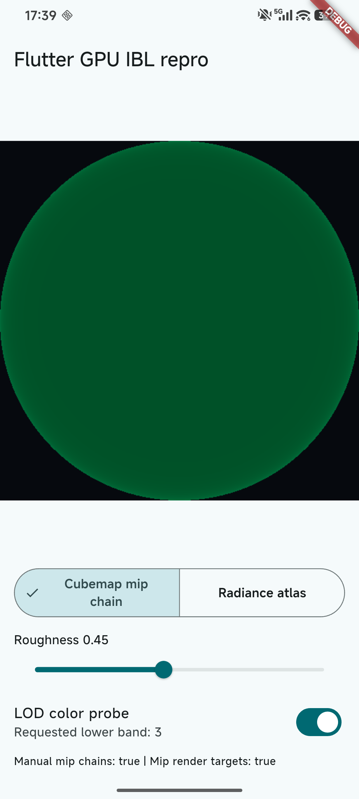

# Flutter GPU Manual-Mip Reproduction

This Android Flutter GPU app isolates manual cubemap-mip sampling from `flutter_scene`. It renders a reflective sphere with no scene graph, directional lights, shadow map, material system, or `flutter_scene` dependency.

The Cubemap mode uploads six faces for each of eight explicitly supplied mip levels and samples with `samplerCube` plus `textureLod`. The Atlas mode encodes the same environment as eight vertically stacked roughness bands. The LOD color probe assigns a distinct color to each band, so the result demonstrates the selected mip level rather than relying only on perceived blur.

## Branches

`main` is the official-engine baseline. It intentionally uses a normal mip-linear sampler and reproduces the Adreno Vulkan behavior where explicitly supplied cubemap mip levels are clamped to level 0.

`patched-manual-mip` adds only `allowManualMipSampling: true` to the complete manually supplied cubemap chain. It must be run with a Flutter engine that contains the corresponding engine patch; this branch is not expected to compile with an official engine that predates that API.

## Expected Results

At roughness `0.45`, the probe requests band 3. At roughness `1.00`, it requests band 7.

| Device / build | Cubemap band 3 | Cubemap band 7 |
| --- | --- | --- |
| Adreno official-engine baseline | red band 0 | red band 0 |
| Adreno patched local engine | green band 3 | gray band 7 |

## Evidence

The primary comparison is Redmi K60 Pro / Adreno 740 on Android Vulkan. The probe images encode the sampled cubemap mip: red is band 0, green is band 3, and gray is band 7.

| Roughness | Build | Visual result | LOD probe result |
| --- | --- | --- | --- |
| `1.00` | Official-engine baseline | <a href="docs/evidence/redmi-k60pro-adreno740-baseline-cubemap-r1.00-visual.png"></a><br>Reflection remains overly sharp. | <a href="docs/evidence/redmi-k60pro-adreno740-baseline-cubemap-r1.00-lod-band7-observed-band0-red.png"></a><br>Requested band 7, observed red band 0. |
| `1.00` | Patched local engine | <a href="docs/evidence/redmi-k60pro-adreno740-patched-cubemap-r1.00-visual.png"></a><br>Reflection becomes diffuse. | <a href="docs/evidence/redmi-k60pro-adreno740-patched-cubemap-r1.00-lod-band7-gray.png"></a><br>Observed gray band 7. |
| `0.45` | Official-engine baseline | <a href="docs/evidence/redmi-k60pro-adreno740-baseline-cubemap-r0.45-visual.png"></a><br>Reflection remains overly sharp. | <a href="docs/evidence/redmi-k60pro-adreno740-baseline-cubemap-r0.45-lod-band3-observed-band0-red.png"></a><br>Requested band 3, observed red band 0. |
| `0.45` | Patched local engine | <a href="docs/evidence/redmi-k60pro-adreno740-patched-cubemap-r0.45-visual.png"></a><br>Reflection becomes diffuse. | <a href="docs/evidence/redmi-k60pro-adreno740-patched-cubemap-r0.45-lod-band3-green.png"></a><br>Observed green band 3. |

## Run the Baseline

Use a Flutter revision that contains `flutter_gpu`; the reference baseline for this investigation is framework revision `ea1bc5dc4f6fedce69957417b6907e45615146e2`, then run:

```sh
flutter pub get
flutter run --enable-flutter-gpu -d <device-tcp-serial>
```

Record the device model, Android version, Flutter framework revision, engine revision, Impeller backend, selected mode, roughness, and the two capability values shown by the app.

## Run With a Local Engine Patch

Check out `patched-manual-mip`, build matching host and Android arm64 local-engine outputs, then run with the corresponding local-engine flags:

```sh
flutter run --enable-flutter-gpu -d <device-tcp-serial> \
  --local-engine=android_debug_unopt_arm64 \
  --local-engine-host=host_debug_unopt \
  --local-engine-src-path=<engine-src>
```

## Scope

This repository establishes that the discrepancy survives without `flutter_scene` and distinguishes the requested LOD from the sampled result. It does not by itself attribute the behavior to a specific Flutter layer or driver implementation, and it does not cover directional-light shadow artifacts.
